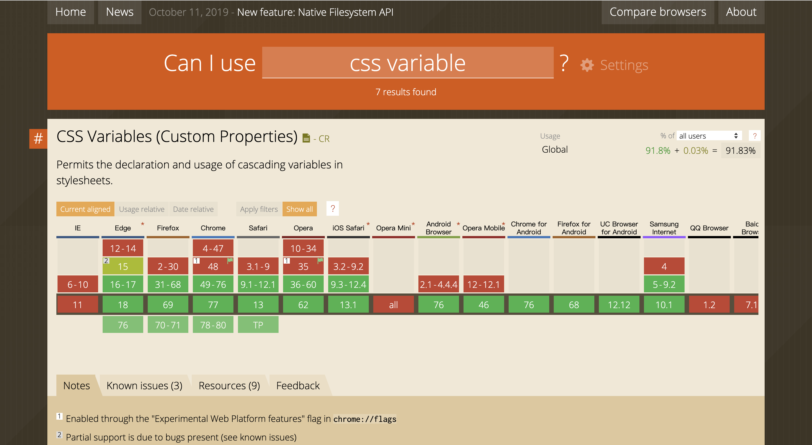

基本所有的 CSS 预处理器都支持变量的特性，比如 SASS：

```scss
$color: white;

p {
  color: $color;
}

button {
  color: $color;
}
```

支持将一个复用属性赋值给变量，然后在其他地方可以使用这个变量，当需要修改这个属性值的时候，只需要修改这个变量，而不用修改每个使用到的位置。

遗憾的是，CSS 预处理器的变量只能在开发的时候可变，在编译结果中变量无法改变。比如，上面的 SASS 就会被编译成这样的 CSS：

```css
p {
  color: white;
}

button {
  color: white;
}
```

CSS 变量是标准 CSS 支持的特性，和 JavaScript 配合实现了真正意义上的可变性。CSS 变量声明主要包含`变量声明`和`使用变量`两个部分。

## 变量声明

和其他 CSS 属性类似，声明一个变量只需要在你设定的变量名前加上`--`符号

```css
div {
  --theme: white;
  --variable: 3px;
  --background: black;
  --Background: black;
  --Background: white;
}
```

需要注意的点是:

1. CSS 变量是区分大小写的，上面的 `--background` 和 `--Background` 表示不同的两个变量
2. 和其他 CSS 属性规则类似，多次声明同一个变量，生效的值是最后一个，上面 `--Background` 的值为 `white`

还有一个作用域问题，比如有一个这样的 DOM 和样式：

```html
<style>
  :root {
    --theme: white;
    --size: 16px;
  }
  .a {
    --size: 14px;
  }
  .b {
    --size: 12px;
    --scale: 1;
  }
</style>

<div class="a">
  <div class="b">
    text
  </div>
</div>
```

和 JS 的作用域类似，子元素可以访问父元素的变量，而父元素无法访问子元素的变量，另一个特点是子元素会屏蔽同名父元素的变量。比如，在 `a` 中，`size` 的值是 `14px`，`theme` 没有在 `a` 中声明，所以 `theme` 是顶层 `:root` 中的值 `white`，而 `scale` 只在 `b` 中声明了，所以 `a` 无法获取到 `scale` 的值。

## 使用变量

使用变量主要通过 [var 函数](https://developer.mozilla.org/zh-CN/docs/Web/CSS/var)。`var()` 接收两个参数，第一个是变量名，第二个是可选的默认值：

```css
/* css属性: var(变量名, 默认值); */
--size: 12px;
font-size: var(--size, 16px);
```

怎么实现变量可变呢？主要是通过 JavaScript 修改变量的值：

```js
document.querySelector('selector').style.setProperty('--variable', 'value');
```

当修改一个 CSS 变量的时候，引用这个变量的所有样式都会更新并且重新渲染。

## 适用场景

### 动态主题

对于很多 WEB 应用来说，动态主题是比较麻烦的。以 SASS 为例，比如以下样式：

```sass
$theme: white;

p {
  color: $theme;
}

button {
  background-color: $theme;
}
```

当我需要白色和黑色两套主题时，将 `$theme` 赋值 `white` 然后编译出白色主题 CSS，将 `$theme` 赋值 `black` 然后编译出黑色主题 CSS，从而得到两套主题的 CSS 文件，在更换主题时我们需要通过 JS 动态修改主题 CSS 引用。

通过 CSS 变量，我们不需要生产两份 CSS 文件，只需要定义变量，更换主题只需要修改变量值就可以了。

```html
<body>
  <p>我是段落</p>
  <div class="action">
    <button type="button" onclick="changeTheme('light')">白色主题</button>
    <button type="button" onclick="changeTheme('dark')">黑色主题</button>
  </div>
</body>
```

```css
body {
  color: var(--color, black);
  background: var(--background, white);
  transition: all 0.3s;
}
```

```js
function changeTheme(theme) {
  switch (theme) {
    case 'light': {
      document.documentElement.style.setProperty('--color', 'black');
      document.documentElement.style.setProperty('--background', 'white');
      break;
    }
    case 'dark': {
      document.documentElement.style.setProperty('--color', 'white');
      document.documentElement.style.setProperty('--background', 'black');
      break;
    }
  }
}
```

[这里查看效果](/demo/theme_by_css_variable.html)。

### 不定高度渐变

CSS transition 是不支持 `auto` 值的，所以当一个元素高度不确定且需要高度渐变，往往需要 JS 计算并且操作 DOM 才能产生渐变效果，通过 CSS 变量可以极大地减少代码量和计算量。[具体实现看这里](https://css.30secondsofcode.org/snippet/height-transition)。

CSS 变量适用场景远远不止这些，限制你的永远是想象力。

## 兼容性

所有的新特性都需要考虑兼容性的问题，CSS 变量也不例外，目前主流浏览器都已经支持 CSS 变量，对于一些低版本的浏览器，可以使用[垫片库](https://github.com/jhildenbiddle/css-vars-ponyfill)。



## 参考资料

- [使用 CSS 变量 - MDN](https://developer.mozilla.org/zh-CN/docs/Web/CSS/Using_CSS_custom_properties)
- [CSS 变量教程 - 阮一峰的网络日志](https://www.ruanyifeng.com/blog/2017/05/css-variables.html)
- [Height transition - 30 seconds of CSS](https://css.30secondsofcode.org/snippet/height-transition)
